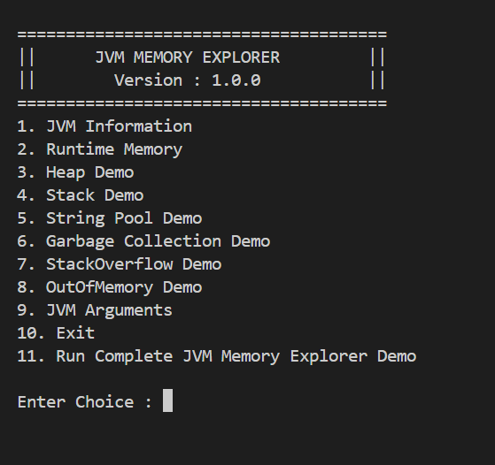
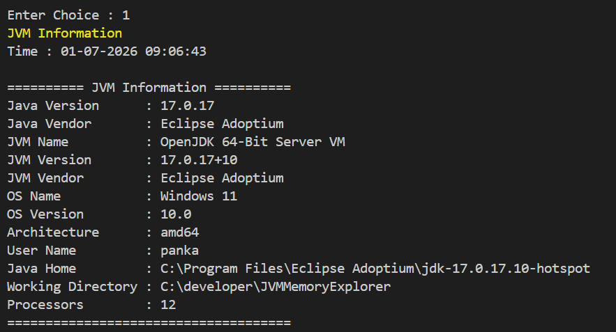
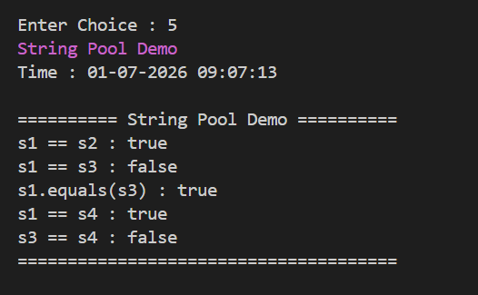

# ☕ Java JVM Memory Explorer

A console-based Java project that demonstrates how JVM memory works internally.

This project was built as part of my Java Mastery learning journey to deeply understand JVM internals through practical implementation instead of theory alone.

---

## Features

- JVM Information
- Runtime Memory Explorer
- Heap Memory Demo
- Stack Memory Demo
- String Pool Demo
- Garbage Collection Demo
- StackOverflowError Demo
- OutOfMemoryError Demo
- JVM Arguments Viewer
- Run Complete JVM Memory Explorer Demo

---

## JVM Concepts Covered

- JVM Architecture
- Runtime Memory Areas
- Heap Memory
- Stack Memory
- Object Creation
- Garbage Collection
- Reachability Analysis
- GC Roots
- String Pool
- String intern()
- Runtime API
- JVM Arguments
- StackOverflowError
- OutOfMemoryError

---

## Technologies

- Java 17
- JVM
- Runtime API
- ManagementFactory
- VS Code

---

## Project Structure

```text
src
│
├── app
├── gc
├── heap
├── jvm
├── oom
├── runtime
├── stack
├── stringpool
└── util
```

---

## Screenshots

### Main Menu



---

### JVM Information



---

### String Pool Demo



---

## Learning Outcomes

This project helped me understand:

- JVM Internals
- Heap vs Stack
- Runtime Memory
- Garbage Collection
- String Pool
- JVM Startup Arguments
- StackOverflowError
- OutOfMemoryError

---

## Future Improvements

- JVM Monitor Dashboard
- MemoryMXBean
- ThreadMXBean
- GC Monitoring
- Live JVM Statistics

---

## Author

**Ravindra Bijarniya**
